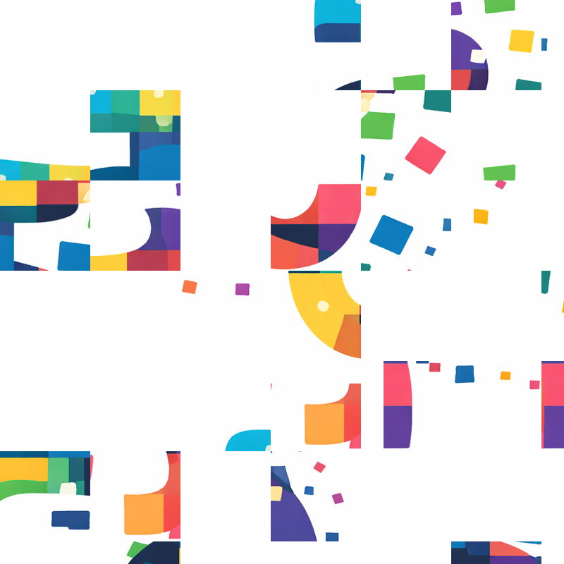
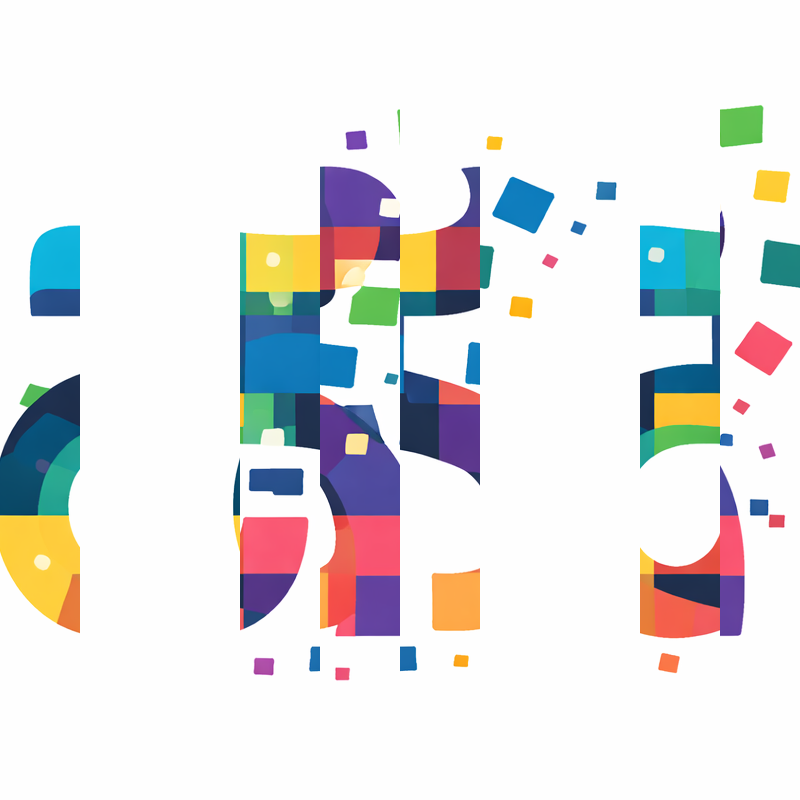

# Kadaru ಕದರು

**Kadaru** (ಕದರು) means "mix" or "scramble" in Kannada. This web application scrambles images while preserving local texture and destroying global structure.

🌐 **Live Site**: [https://pvnkmrksk.github.io/Kadaru/](https://pvnkmrksk.github.io/Kadaru/)

## 🎨 What It Does

Kadaru scrambles images by shuffling blocks or columns while preserving local texture. Here's the Kadaru logo scrambled in two different modes:

**Block Mode** (64px blocks):

**Column Mode** (10 columns):

## 🌟 Features

### Scrambling Modes
- **Block Mode**: Splits the image into square blocks and shuffles them
- **Column Mode**: Splits the image into vertical strips/columns and shuffles them

### Customizable Parameters
- **Block Size / Column Count**: Control the granularity of scrambling
- **Max Scramble Distance**: Constrain how far blocks/columns can move (preserves some spatial locality)
- **Seeded Random**: Consistent scrambling for the same image

### Additional Features
- Real-time preview with before/after comparison
- PNG download of scrambled images
- Maintains original image dimensions and quality
- Responsive design for mobile and desktop
- Beautiful, minimal UI
- Works offline (PWA support)
- Settings persist across sessions

## 📖 How It Works

### Block Mode
- Divides image into a grid of square blocks
- Shuffles blocks using a seeded random number generator
- Optional distance constraint limits block movement

### Column Mode
- Divides image into N vertical strips
- Shuffles columns left-right
- Optional distance constraint limits column movement
- Preserves vertical coherence within each strip

### Seeded Randomization
The scrambler uses a seed derived from:
- Image dimensions (width × height)
- First 100 pixel values

This ensures:
- Same image always produces same scrambling
- Different images produce different scrambling
- Reproducible results

## 🎨 Use Cases

- **Privacy**: Obscure sensitive images while preserving texture
- **Art**: Create abstract compositions from photos
- **Research**: Study texture vs. structure in image recognition
- **Data Augmentation**: Generate varied training data

## 🛠️ Technical Details

- **Pure JavaScript**: No external dependencies
- **Canvas API**: Direct pixel manipulation
- **Client-side Processing**: All processing happens in browser
- **PWA Support**: Works offline, can be installed as an app
- **No Build Process**: Just upload and deploy!

## 📱 Browser Support

Works on all modern browsers:
- Chrome/Edge 90+
- Firefox 88+
- Safari 14+
- Mobile browsers (iOS Safari, Chrome Android)

## 🎯 Parameters Guide

### Block Size (Block Mode)
- **Small (1-30px)**: Fine-grained scrambling, abstract result
- **Medium (30-100px)**: Balanced, recognizable elements scrambled
- **Large (100px+)**: Coarse shuffling, maintains larger features

### Column Count (Column Mode)
- **Few (2-10)**: Large vertical strips, minimal scrambling
- **Medium (10-30)**: Balanced column shuffling
- **Many (30+)**: Fine vertical strips, heavily scrambled

### Max Scramble Distance
- **0%**: Strong constraint, mostly local shuffling
- **25-75%**: Moderate constraint, regional scrambling
- **100% (Unlimited)**: Complete random shuffling

## 💡 Tips

1. **Start with default settings** and adjust from there
2. **Large images** (>2000px) may be slow to process
3. **Column mode** is faster than block mode for most images
4. Use **distance constraints** to preserve some spatial structure

## 🐛 Known Limitations

- Very large images (>4000px) may cause slowdown
- Mobile browsers may have reduced performance

## 📄 License

This project is licensed under the MIT License - see the [LICENSE](LICENSE) file for details.

## 🤝 Contributing

This is a single-file application. To modify:
1. Open `index.html` in a text editor
2. Make your changes
3. Test by opening in a browser

## 📞 Support

For issues or questions:
- Open an issue on GitHub
- Check browser console for errors
- Ensure browser supports Canvas API

---

Made with ❤️ by [@pvnkmrksk](https://github.com/pvnkmrksk)
